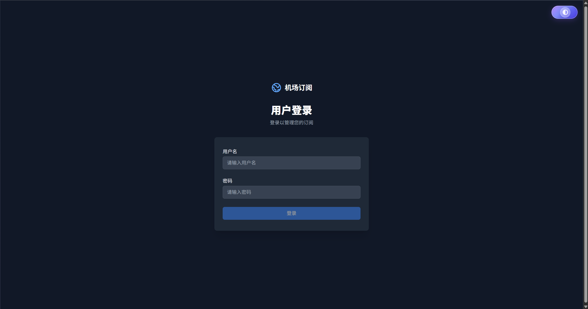
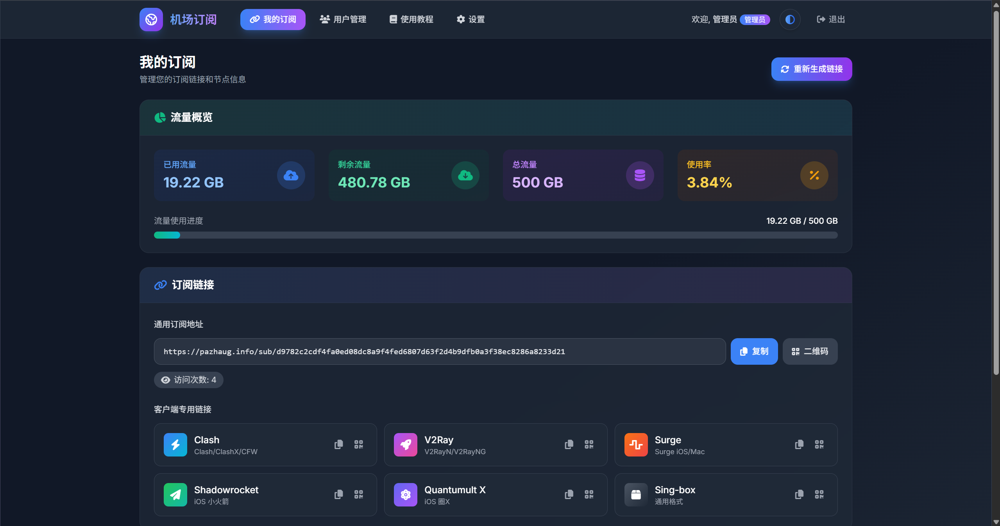

# Subscription Service - 订阅管理服务

[English](README.md) | 中文

一套自托管的订阅管理面板，支持 Hysteria2 和 VLESS 节点管理、用户订阅、流量统计与同步。适用于个人或小团队管理代理节点订阅。

## 界面预览

| 登录页面 | 管理面板 |
|:--------:|:--------:|
|  |  |

## 功能特性

### 核心功能

| 功能 | 描述 |
|------|------|
| **用户管理** | 支持管理员和普通用户角色，管理员可创建和管理下级用户 |
| **订阅链接** | 自动生成带 Token 的订阅链接，支持过期时间和一次性使用限制 |
| **多节点支持** | 支持 Hysteria2 和 VLESS (gRPC/WebSocket/TCP) 节点配置 |
| **流量统计** | 自动从 Hysteria2 同步用户流量数据，支持流量限制和重置 |
| **Hysteria2 认证** | 内置 HTTP 认证服务，可直接对接 Hysteria2 服务端 |
| **一键部署** | Docker Compose 一键安装，自动生成密钥和配置 |

### 前端面板功能

| 模块 | 功能 |
|------|------|
| **我的订阅** | 流量仪表盘、订阅链接管理、多格式导出（Clash/V2Ray/Surge/Shadowrocket/Quantumult X/Sing-box）、节点列表、二维码生成 |
| **用户管理** | 下级用户统计、创建/编辑/删除用户、重置密码、重置流量、重新生成订阅链接 |
| **使用教程** | 快速开始指南、多客户端教程（Clash Verge/V2RayN/Shadowrocket/V2RayNG）、常见问题 |
| **账号设置** | 修改密码 |

### 技术特性

- **独立前后端架构** - Vue 3 + Pinia 前端，Express 后端，可独立部署
- **响应式设计** - 支持桌面端和移动端
- **深色/浅色主题** - 支持主题切换
- **会话管理** - Redis 缓存会话，24 小时有效期
- **健康检查** - 内置 `/sub/health` 端点，支持容器健康检查

## 系统要求

| 项目 | 最低要求 |
|------|----------|
| 操作系统 | Linux (Ubuntu 20.04+, Debian 11+, CentOS 8+) |
| Docker | 20.10+ |
| Docker Compose | v2.0+ (插件) 或 1.29+ (独立版) |
| 内存 | 512 MB |
| 磁盘 | 1 GB 可用空间 |
| 端口 | 18080 (可配置) |

## 快速开始

### 1. 克隆仓库

```bash
git clone https://github.com/hanfengchui/subscription-service.git
cd subscription-service
```

### 2. 一键安装

**交互式安装**（推荐首次安装）：

```bash
bash scripts/install.sh
```

交互式安装会引导你完成：
- Hysteria2 节点配置（服务器、端口、SNI、认证方式）
- VLESS 节点配置（服务器、端口、UUID、传输方式）
- 流量同步设置

**非交互式安装**（适用于自动化部署）：

```bash
bash scripts/install.sh --non-interactive
# 或使用简写
bash scripts/install.sh -y
bash scripts/install.sh --yes
bash scripts/install.sh --auto
```

非交互模式特点：
- 跳过所有用户提示
- 自动检测可用端口（如默认端口被占用）
- 跳过节点配置（安装后可手动编辑 `.env` 文件）
- 适合 CI/CD 或脚本化部署

**安装脚本功能**：

| 功能 | 描述 |
|------|------|
| Docker 环境检查 | 自动检测 Docker 版本（需要 20.10+）和 Compose 插件 |
| 公网 IP 检测 | 自动获取服务器公网 IP 用于生成订阅链接 |
| 配置自动检测 | 自动搜索已有的 Hysteria2/Xray 配置文件并提取参数 |
| 端口检测 | 检查端口占用，非交互模式自动寻找可用端口 |
| 密钥生成 | 自动生成随机的 API 密钥、数据库密码等 |
| 服务健康检查 | 等待所有服务就绪后显示访问信息 |

**Hysteria2 配置自动检测路径**：
- `/etc/hysteria/config.yaml`
- `/opt/hysteria/config.yaml`
- `/root/hysteria/config.yaml`
- `/usr/local/etc/hysteria/config.yaml`

**Xray/VLESS 配置自动检测路径**：
- `/usr/local/etc/xray/config.json`
- `/etc/xray/config.json`
- `/etc/v2ray/config.json`

### 3. 一键卸载

如需完全卸载，运行：

```bash
bash scripts/uninstall.sh
```

卸载脚本会清理：
- 所有 Docker 容器和镜像
- 数据卷（包括数据库数据）
- Docker 网络和构建缓存
- .env 配置文件
- 可选删除整个项目目录

### 4. 访问服务

安装完成后：
- **前端面板**: `http://<服务器IP>:18080/`
- **API 接口**: `http://<服务器IP>:18080/sub/`
- **健康检查**: `http://<服务器IP>:18080/sub/health`

### 5. 获取管理员密钥

```bash
grep SUB_ADMIN_API_KEY .env
```

使用此密钥调用管理员 API 创建用户。

### 6. 默认管理员账号

首次启动会自动创建一个 `admin` 账号（可通过 `SUB_INIT_ADMIN=false` 关闭），默认密码会写入后端日志：

```bash
docker compose -f deploy/compose/docker-compose.yml --env-file .env logs --tail=200 backend | grep "Default admin password"
```

## 架构说明

```
┌─────────────────────────────────────────────────────────────┐
│                      Nginx (:18080)                         │
│  ┌─────────────────────┐  ┌─────────────────────────────┐   │
│  │   静态文件 (前端)    │  │   /sub/* → Backend (:3000)  │   │
│  └─────────────────────┘  └─────────────────────────────┘   │
└─────────────────────────────────────────────────────────────┘
                                │
                                ▼
┌─────────────────────────────────────────────────────────────┐
│                    Backend (Express)                        │
│  ┌──────────────┐ ┌──────────────┐ ┌──────────────────────┐ │
│  │  用户认证     │ │  订阅管理    │ │  Hysteria2 认证服务   │ │
│  │  /sub/auth/* │ │  /sub/:token │ │  (:9998)             │ │
│  └──────────────┘ └──────────────┘ └──────────────────────┘ │
│  ┌──────────────┐ ┌──────────────┐                          │
│  │  管理员 API   │ │  流量同步    │                          │
│  │  /sub/admin/*│ │  (定时任务)  │                          │
│  └──────────────┘ └──────────────┘                          │
└─────────────────────────────────────────────────────────────┘
         │                    │
         ▼                    ▼
┌─────────────────┐  ┌─────────────────┐
│  MySQL (:3306)  │  │  Redis (:6379)  │
│  用户/订阅数据   │  │  会话缓存       │
└─────────────────┘  └─────────────────┘
```

## 支持的代理协议

### Hysteria2

- **链接格式**: `hysteria2://<password>@<server>:<port>/?insecure=<0|1>&sni=<sni>#<name>`
- **认证方式**:
  - 使用订阅 Token 作为密码（推荐，需配合认证服务）
  - 使用固定密码（兼容旧配置）
- **流量统计**: 支持从 Hysteria2 API 自动同步

### VLESS

- **链接格式**: `vless://<uuid>@<server>:<port>?encryption=none&security=tls&...`
- **传输方式**: gRPC、WebSocket、TCP
- **加密**: TLS

## 与 Hysteria2 集成

本服务可作为 Hysteria2 的认证后端，实现基于订阅 Token 的用户认证。

### 配置 Hysteria2 服务端

在 Hysteria2 的 `config.yaml` 中配置 HTTP 认证：

```yaml
auth:
  type: http
  http:
    url: http://127.0.0.1:9998/auth  # 本服务的认证端点
    insecure: false
```

### 配置本服务

在 `.env` 中启用 Hysteria2 认证服务：

```bash
HY2_AUTH_ENABLED=true
HY2_AUTH_PORT=9998
HY2_AUTH_SECRET=your-secret  # 可选，用于验证请求来源
```

### 流量同步

本服务可自动从 Hysteria2 的流量统计 API 同步用户流量数据：

```bash
HY2_STATS_URL=http://127.0.0.1:9999
HY2_STATS_SECRET=your-hysteria2-stats-secret
TRAFFIC_SYNC_ENABLED=true
TRAFFIC_SYNC_INTERVAL=60000  # 同步间隔（毫秒）
```

## 配置说明

复制 `.env.example` 为 `.env` 并按需修改：

```bash
cp .env.example .env
```

### 基础配置

| 变量 | 说明 | 默认值 |
|------|------|--------|
| `APP_PORT` | 对外服务端口 | 18080 |
| `NODE_ENV` | 运行环境 | production |
| `SUB_ADMIN_API_KEY` | 管理员 API 密钥 | 自动生成 |
| `SUB_PUBLIC_BASE_URL` | 订阅链接的公开地址 | 自动检测 |
| `SUB_INIT_ADMIN` | 首次启动是否创建默认管理员 | true |

### Hysteria2 节点配置

| 变量 | 说明 |
|------|------|
| `SUB_HY2_SERVER` | Hysteria2 服务器地址 |
| `SUB_HY2_PORT` | Hysteria2 端口（默认 443） |
| `SUB_HY2_PASSWORD` | 密码（使用 `%TOKEN%` 表示用户 Token） |
| `SUB_HY2_SNI` | TLS SNI |
| `SUB_HY2_INSECURE` | 是否跳过证书验证 |

### VLESS 节点配置

| 变量 | 说明 |
|------|------|
| `SUB_VLESS_SERVER` | VLESS 服务器地址 |
| `SUB_VLESS_PORT` | VLESS 端口（默认 443） |
| `SUB_VLESS_UUID` | VLESS UUID |
| `SUB_VLESS_SNI` | TLS SNI |
| `SUB_VLESS_TYPE` | 传输类型（grpc/ws/tcp） |
| `SUB_VLESS_SERVICE_NAME` | gRPC serviceName |

### 流量同步配置

| 变量 | 说明 | 默认值 |
|------|------|--------|
| `HY2_STATS_URL` | Hysteria2 流量统计 API 地址 | http://127.0.0.1:9999 |
| `HY2_STATS_SECRET` | 流量统计 API 密钥 | - |
| `TRAFFIC_SYNC_ENABLED` | 是否启用流量同步 | true |
| `TRAFFIC_SYNC_INTERVAL` | 同步间隔（毫秒） | 60000 |

### 认证服务配置

| 变量 | 说明 | 默认值 |
|------|------|--------|
| `HY2_AUTH_ENABLED` | 是否启用认证服务 | true |
| `HY2_AUTH_PORT` | 认证服务端口 | 9998 |
| `HY2_AUTH_SECRET` | 认证服务密钥 | - |

详细配置请参考：[配置文档](docs/config.zh-CN.md)

## API 文档

- [API 文档 (中文)](docs/api.zh-CN.md)
- [API Documentation (English)](docs/api.md)

### API 端点概览

| 端点 | 描述 |
|------|------|
| `GET /sub/health` | 健康检查 |
| `POST /sub/auth/login` | 用户登录 |
| `GET /sub/auth/subscription` | 获取订阅信息 |
| `GET /sub/:token` | 获取订阅内容 |
| `GET /sub/admin/users` | 获取用户列表（需管理员密钥） |
| `POST /sub/admin/users` | 创建用户（需管理员密钥） |

### 快速示例

创建用户：

```bash
curl -X POST http://localhost:18080/sub/admin/users \
  -H "Content-Type: application/json" \
  -H "X-Sub-Admin-Key: YOUR_ADMIN_KEY" \
  -d '{
    "username": "alice",
    "password": "password123",
    "name": "Alice",
    "role": "user"
  }'
```

## 项目结构

```
subscription-service/
├── apps/
│   ├── backend/          # Express 后端
│   │   ├── src/
│   │   │   ├── routes/       # API 路由
│   │   │   ├── services/     # 业务逻辑
│   │   │   │   ├── subscriptionService.js   # 订阅服务
│   │   │   │   ├── subUserService.js        # 用户服务
│   │   │   │   ├── trafficSyncService.js    # 流量同步
│   │   │   │   └── hysteria2AuthService.js  # Hysteria2 认证
│   │   │   ├── models/       # 数据模型
│   │   │   └── middleware/   # 中间件
│   │   └── Dockerfile
│   └── frontend/         # Vue 3 前端
│       ├── src/
│       │   ├── views/        # 页面组件
│       │   ├── stores/       # Pinia 状态管理
│       │   └── router/       # 路由配置
│       └── Dockerfile
├── deploy/
│   ├── compose/          # Docker Compose 配置
│   └── nginx/            # Nginx 配置
├── scripts/
│   ├── install.sh        # 一键安装脚本
│   └── uninstall.sh      # 一键卸载脚本
├── docs/                 # 文档
├── .env.example          # 环境变量示例
└── README.md
```

## 常用命令

```bash
# 查看服务状态
docker compose -f deploy/compose/docker-compose.yml ps

# 查看日志
docker compose -f deploy/compose/docker-compose.yml logs -f

# 查看特定服务日志
docker compose -f deploy/compose/docker-compose.yml logs -f backend

# 重启服务
docker compose -f deploy/compose/docker-compose.yml --env-file .env restart

# 停止服务
docker compose -f deploy/compose/docker-compose.yml --env-file .env down

# 更新并重启
git pull
docker compose -f deploy/compose/docker-compose.yml --env-file .env up -d --build
```

## 常见问题

### 安装相关

**Q: 端口被占用怎么办？**

A: 交互模式会提示输入新端口，非交互模式会自动寻找可用端口。也可以手动修改 `.env` 中的 `APP_PORT`。

**Q: 如何修改节点配置？**

A: 编辑 `.env` 文件中的 `SUB_HY2_*` 和 `SUB_VLESS_*` 变量，然后重启服务。

**Q: 忘记管理员密码怎么办？**

A: 查看后端日志获取默认密码，或删除数据库中的用户记录后重启服务自动创建新管理员。

更多问题参考 [FAQ](docs/faq.zh-CN.md)

## 安全建议

- 不要将 `.env` 文件提交到版本控制
- 定期轮换 `SUB_ADMIN_API_KEY`
- 生产环境建议配置 HTTPS（通过反向代理）
- 不要对公网暴露 MySQL/Redis 端口

详细安全建议请参考：[安全文档](docs/security.zh-CN.md)

## 许可证

[MIT](LICENSE)
